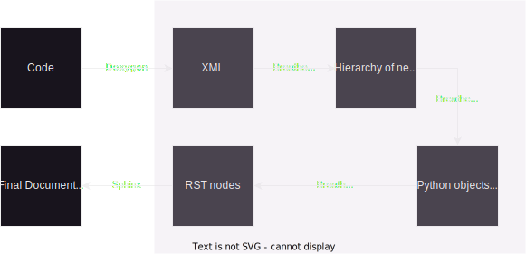

.. _codeguide:

How It Works
============

There are three main sections to Breathe: parser, finders and renderers.
Briefly:

   **parser**
      Responsible for reading the doxygen xml output and creating objects
      representing the data. Found in ``breathe.parser``.
      
   **finders**
      Responsible for finding reference objects within the output from the
      parser. Found in ``breathe.finder``.

   **renderers**
      Responsible for producing reStructuredText nodes to represent the objects
      that the finders have found. The renderers generally descend through the
      object hierarchies rendering the objects, their children, their children's
      children and so on. Found in ``breathe.renderer``.

The following flow chart shows how the different components of Breathe transform 
data. The shaded region indicates which components are part of Breathe.

.. image:: ../assets/BreatheFlowChart.svg
  :width: 500
  :alt: A flow chart showing that the initial input format is code. Doxgyen converts 
        code to XML. The Breathe parser converts XML to a hierarchy of python objects.
        The Breathe Filter identifies which of these objects need to be rendered. The
        Breathe Renderer converts these objects into reStructuredText (RST) nodes.
        Finally, the RST node objects are passed to Sphinx to be turned into actual
        HTML or LaTeX documents. 
  :class: only-light
  :align: center

        code to XML. The Breathe parser converts XML to a hierarchy of python objects.
        The Breathe Filter identifies which of these objects need to be rendered. The
        Breathe Renderer converts these objects into reStructuredText (RST) nodes.
        Finally, the RST node objects are passed to Sphinx to be turned into actual
        HTML or LaTeX documents.
  :class: only-dark
  :align: center

Parser
------

The parser's job is to parse the doxygen xml output and create a hierarchy of
Python objects to represent the xml data.

Doxygen XML Output
~~~~~~~~~~~~~~~~~~

The xml output from doxygen comes in multiple files. There is always an
``index.xml`` file which is a central reference point and contains a list of all
the other files that have been generated by doxygen and an indication of what
they contain. 

For example, in ``examples/doxygen/func/xml`` directory, the ``index.xml`` file
contains:

.. code-block:: xml

   <?xml version='1.0' encoding='UTF-8' standalone='no'?>
   <doxygenindex xmlns:xsi="http://www.w3.org/2001/XMLSchema-instance" xsi:noNamespaceSchemaLocation="index.xsd" version="1.7.2">
     <compound refid="class_test" kind="class"><name>Test</name>
       <member refid="class_test_1a45b6a232a4499f8ce37062eab5451570" kind="function"><name>member</name></member>
     </compound>
     <compound refid="func_8h" kind="file"><name>func.h</name>
     </compound>
   </doxygenindex>

This suggests there is additional information about a class called **Test**
which has a function called **member**. Additionally there is some more
information about a file called **func.h**.

Now, the ``refid`` attribute on the ``compound`` xml nodes gives an indication
of where the additional information can be found. So for the **Test** class, we
should look in ``class_test.xml``, which we get by simply appending ``.xml`` to
the ``refid`` value, and for the **func.h** file we should look in
``func_8h.xml``.

So the ``index.xml`` file is unique in its role and has its own structure which
is defined in the ``index.xsd`` file which you will also find in the same
directory. All the other files, the ones referenced by the ``index.xml`` file, follow
another structure. This is described in ``compound.xsd`` file so we call these
other files **compound** files. These are generally longer than the
``index.xml`` file and contain all the specific information you might expect
from doxygen, including any documentation you added to your code as doxygen
markup.

Have a look at ``examples/doxygen/func/xml/class_test.xml`` for a fairly short
example.

Doing the Parsing
~~~~~~~~~~~~~~~~~

To get things up and running quickly, I have used the `generateDS
<https://pypi.org/project/generateDS/>`_ project to help create
classes to parse the doxygen xml output. The script automatically creates the
``compound.py``, ``compoundsuper.py``, ``index.py`` and ``indexsuper.py`` files
that you can see inside ``breathe/parser/doxygen``.

So what is the difference between ``index.py`` and ``indexsuper.py``, and
``compound.py`` and ``compoundsuper.py``? These files allow us to separate the
bulk of the automatically generated code from the code changes we might want to
make. There are a large number of classes in the ``...super.py`` files and each
one has a basic derived class in the corresponding non-super files.

It is designed so that all the hard work done by the generated code is
done in the ``...super.py`` files and if we need to make changes we can do them
in the derived classes in the non-super files and if we ever need to regenerate
the code, we only regenerate the ``...super.py`` files and so we don't lose our
changes in the process.

The end result is that for the parsing, we have written relatively little code,
but have a large amount automatically generated for us. This has only been done
once and it seems relatively unlikely that we'll do it again. The entry points to
the parsing code is the ``parse`` functions at the bottom of the
``breathe.parser.doxygen.compound`` and ``breathe.parser.doxygen.index``.

I have never really examined the details of the parsing but you can see that
there is a class for each node type you are likely to find in the xml files. I
say "node type" instead of just "node" because different nodes can share the
same type and there is one class per type. For example, there are
**detaileddescription** nodes and **briefdescription** nodes which are both of
type **descriptionType**. If we look in ``breathe.parser.doxygen.compoundsuper``
we see a **descriptionType** class and in
``breathe.parser.doxygen.compound`` we see a **descriptionTypeSub** class which
is derived from **descriptionType**.

Our Changes
~~~~~~~~~~~

You'll notice there are some classes in the non-super files that have some
additional code in them. This tends to be adjusting the ``buildChildren`` member
function in the derived class to extend or override the one in the
automatically generated base class.

We have to do this sometimes as it seems the original code we generated with
``generateDS`` fails to construct the children of some classes. The
``generateDS`` scripts uses the descriptions in the ``.xsd`` files to determine
what classes to generate and what nodes can be the children of other nodes. It
is possible that the doxygen ``.xsd`` files contain levels of abstraction that
the ``generateDS`` project did not cope with at the time I used it. It is
possible that newer versions would handle it better but for the moment I'm
content updating the derived classes to handle the cases I see missing.

Finders
-------

The finder classes have a relatively small but important job of finding objects
in the hierarchy generated by the parsers. For example, when a user specifies a
particular class for the :ref:`doxygenclass directive <doxygenclass>`, we use
the finder classes to go and find the object corresponding to that class.

In fact, if you look closely, it is the finders that use the parser entry points
to parse the xml and then find the objects. The finders also use ``Filter``
objects to actually figure out if they have found what they are looking for. 

The finder is given a hierarchy of filter objects which are designed to match
at different levels of the XML hierarchy. Filters can also represent logical
conditions such as 'and' and 'or'.

More Details, Please
~~~~~~~~~~~~~~~~~~~~

So initially, we create a finder to look at the root of the hierarchy: the
**doxygenTypeSub** node. That finder, handily called
**DoxygenTypeSubItemFinder** (you'll notice a lot of that) looks through all the
child compound nodes of the **doxygenTypeSub** node and tries a compound-level
match against each of them and if something matches it creates a
**CompoundTypeSubItemFinder** to look further. 

In turn, that checks each of its member child nodes with a member-level match
and if it finds one it creates a **MemberTypeSubItemFinder** (see the pattern?)
and that does another check. The interesting part is, if that is successful, the
**CompoundTypeSubItemFinder** finds the corresponding xml file that has more
information in it (remember ``refid + .xml``?) and parses that and creates
another finder to start looking in there. This time it is a
**DoxygenTypeSubItemFinder** from the ``breathe.finder.doxygen.compound``
module. And the search goes on until we find an object to return for rendering.

If the **CompoundTypeSubItemFinder** fails to find any deeper levels to match
against then it returns itself as it must be the target we're interested in.

As stated, the job of the finder is to find a single node for the renderers to
starting rendering to reStructuredText. That is all the finder does.

Renderers
---------

Finally, the bit that really does something we care about. Rendering is the art
of turning whatever object we've found in the hierarchy into reStructuredText
nodes. This almost invariably means most of its children as well.

Much like with the finder classes, we start off creating a renderer for a
particular parser object and then it looks at its children and uses the renderer
factory to create appropriate renderers for those objects and tells them to
render and they look at their object's children and create appropriate renderers
for those and so on and so forth.

The node we start at is determined by the finder and ultimately by the user. The
whole process is kicked off by the ``Builder`` class, though it doesn't really
do much. The aim of the renderers is to return a list of reStructuredText nodes
which is passed back to Sphinx to render into whatever you're final output
format is. 

There are two complicated bits here. All the different renderers and all the
different reStructuredText nodes.

Different Renderers
~~~~~~~~~~~~~~~~~~~

Just like with the parsers, there is one renderer per node type. In fact there
is one renderer class per parser class and they are named almost the same and
are designed to match up. The renderers look at the data on the instance
of the corresponding parser class that they have been given and grab the
interesting bits and return reStructuredText nodes.

For reference on what there is to render, you can look at the parser class
definitions or at the raw xml to see what attributes there are to render.
Sometimes if something isn't appearing in the final output, it is because the
renderer isn't returning an reStructuredText representation of it so the
rendering code needs to be updated, and sometimes it is because the parser
classes are not picking it up properly so both the parser and the renderer code
needs to be updated.

Given a little bit of time, you get used to chasing through the xml nodes,
the parser classes and the corresponding renderers to figure out where all the
information is ending up.

reStructuredText Nodes
~~~~~~~~~~~~~~~~~~~~~~

We use the reStructuredText API as provided by the fabulous docutils project
and extended by Sphinx itself. For the most part, they are fairly straight
forward and they are certainly well named.

Unfortunately there are a lot of nodes and only certain ways of combining them.
It is also not always clear what arguments their constructs take. Whilst I'm
sure it would be possible to figure it out with time and the appropriate source
code, the use of them is not something I've found very well documented and my
code largely operates on a basis of trial and error. 

One day I'm sure I'll be enlightened, until then expect fairly naive code.

Testing
-------

Tests for Breathe can be found in the ``tests`` directory. They can be run by
running ``make test`` in your terminal (assuming that you have pytest installed).
The bulk of Breathe's test suite is in  ``tests/test_renderer.py``, and this is
where any renderer-related tests should be added. This documentation will focus
on how to write more renderer tests, as this is the most common region of the code
to add new features to and perhaps the hardest to test.

Creating Python Doxygen Nodes
~~~~~~~~~~~~~~~~~~~~~~~~~~~~~

As indicated in the diagram at the top of this page, the renderer is expecting to 
be run after the parser has created a hierarchy of python objects. Thus, there is
a lot of set-up that would usually happen before the renderer is invoked. For ease
of testing, it is often expedient to skip straight to the step where you have a
hierarchy of Python objects representing some hypothetical XML that doxygen could
have produced. 

``test_renderer.py`` contains a number of classes designed to assist with this
process. For just about any node that could show up in the XML produced by doxygen,
there is a class that quickly instantiates it in Python. For example, if you want
to test the rendering of a member definition, you can use the ``WrappedMemebrDef``
class. Figuring out how nodes fit together can be challenging; until you're
comfortable with the type of XML produced by doxygen, the easiest process is likely:

#. Write C++ code containing the behavior you would like to test.
#. Run Doxygen on it, which will produce an XML file (likely inside a directory 
   called xml within your doxygen output directory)
#. Re-build the relevant part of the xml file in Python using the ``Wrapped*`` 
   classes.

For example, lets say you have a struct representing a cat.

Your C++ might look something like this (inspired by Sy Brand's
`blog post <https://devblogs.microsoft.com/cppblog/clear-functional-c-documentation-with-sphinx-breathe-doxygen-cmake/>`_):

.. code-block:: cpp

   /**
   A fluffy feline
   */
   struct cat {
   /**
      Make this cat look super cute
   */
      void make_cute();
   };

Running Doxygen on this might give you XML something like this:

.. code-block:: xml

   <?xml version='1.0' encoding='UTF-8' standalone='no'?>
   <doxygen xmlns:xsi="http://www.w3.org/2001/XMLSchema-instance" xsi:noNamespaceSchemaLocation="compound.xsd" version="1.9.7" xml:lang="en-US">
   <compounddef id="structcat" kind="struct" language="C++" prot="public">
      <compoundname>cat</compoundname>
      <includes refid="test__cpp_8hpp" local="no">test_cpp.hpp</includes>
         <sectiondef kind="public-func">
            <memberdef kind="function" id="structcat_1" prot="public" static="no" const="no" explicit="no" inline="no" virt="non-virtual">
               <type>void</type>
               <definition>void cat::make_cute</definition>
               <argsstring>()</argsstring>
               <name>make_cute</name>
               <qualifiedname>cat::make_cute</qualifiedname>
               <briefdescription>
               </briefdescription>
               <detaileddescription>
                  <para>Make this cat look super cute </para>
               </detaileddescription>
               <inbodydescription>
               </inbodydescription>
               <location file="test_cpp.hpp" line="8" column="8"/>
            </memberdef>
         </sectiondef>
      <briefdescription>
      </briefdescription>
      <detaileddescription>
         <para>A fluffy feline </para>
      </detaileddescription>
      <location file="test_cpp.hpp" line="4" column="1" bodyfile="test_cpp.hpp" bodystart="4" bodyend="15"/>
      <listofallmembers>
         <member refid="structcat_1" prot="public" virt="non-virtual"><scope>cat</scope><name>make_cute</name></member>
      </listofallmembers>
   </compounddef>
   </doxygen>

There's a lot here. For now, let's just say we're testing something related to 
member function definitions, and we only need to test that part of the 
hierarchy. We can load the ``memberdef`` part of this XML into a 
``WrappedMemberDef`` object as follows:

.. code-block:: python

   member_def = WrappedMemberDef(
      kind="function", #  From "kind" in open memberdef tag
      definition="void cat::make_cute", #  From <definition> tag
      type="void", #  From <type> tag
      name="make_cute", #  From <name> tag
      argstring="()", #  From <argstring> tag
      virt="non-virtual", #  From "virt" in open memberdef tag
   )

As you can see, all of the arguments to the constructor are pulled directly out
of the XML, either from options on the original memberdef or tags nested under 
it. There are a lot more optional arguments that can be provided to specify
additional details of the memberdef.

More advanced hierarchies can be represented by nesting nodes inside each
other. For example, if our function took arguments, it would have ``<param>``
tags nested within it. We could represent these as a list of ``WrappedParam``
objects passed into the ``param`` keyword argument.

To test that the node renders correctly, you can use the ``render`` function
provided in ``test_renderer.py``:

.. code-block:: python

   # Render the node and grab its description
   signature = find_node(render(app, member_def), "desc_signature")
   # You can now examine the contents of signature.astext() and assert that
   # they are as expected

Mocks
~~~~~

If you want to do more elaborate tests, it is useful to be aware of the various
Mock objects provided in ``test_renderer.py``. Because the renderer is 
expecting to be executing in the context of a full Sphinx run, there are a lot
of objects that it is expecting to have access to. For example, rendering some
nodes requires making reference to a context object. The ``MockContext`` class 
can serve as a stand-in.